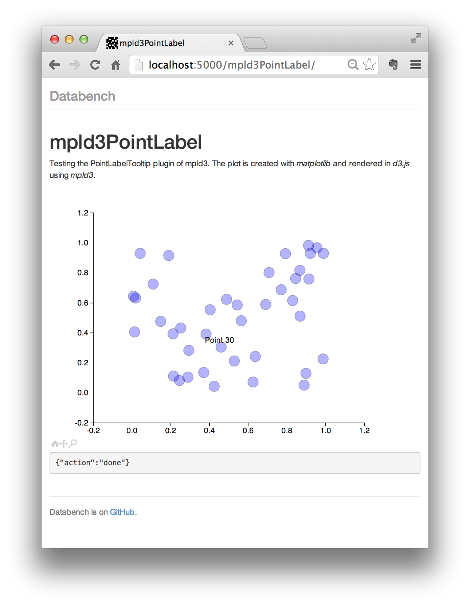

.. image:: http://www.svenkreiss.com/databench/logo.svg
    :target: http://www.svenkreiss.com/databench/v0.3/

Databench Examples
==================

    Example analyses for `Databench <https://github.com/svenkreiss/databench/v0.3/>`_. Live demos of some of them are at `databench-examples.svenkreiss.com <http://databench-examples.svenkreiss.com>`_ and the `Databench documentation is here <http://www.svenkreiss.com/databench/v0.3/>`_.

.. image:: https://travis-ci.org/svenkreiss/databench_examples.png?branch=master
    :target: https://travis-ci.org/svenkreiss/databench_examples

Environment and Install
-----------------------

Setup your environment and install dependencies in the current directory with

    git clone https://github.com/svenkreiss/databench_examples.git .

    virtualenv venv
    source venv/bin/activate
    pip install -r requirements.txt

Example Outputs
---------------

.. image:: doc/images/mpld3pi_demo.png
    :target: http://databench-examples.svenkreiss.com/mpld3pi/

.. image:: doc/images/mpld3_heart_path.png
    :target: http://databench-examples.svenkreiss.com/mpld3Drag/
